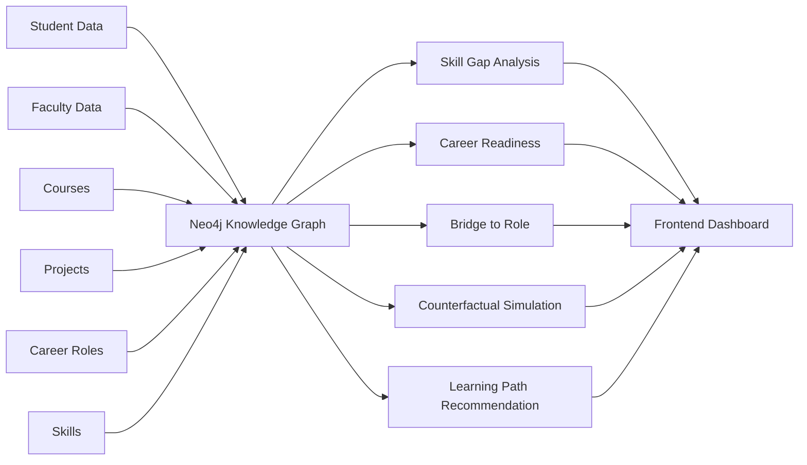

# 🎓 Enterprise Knowledge Graph for Student Career Intelligence

A graph-powered platform that models a student's academic and career ecosystem in Neo4j — turning scattered data (skills, courses, projects, faculty, career roles) into explainable, multi-hop career guidance.


<!-- 📸 Add a screenshot of the dashboard, a sample learning-path result, or a Neo4j graph visualization here -->
<!--  -->

---

## Overview

Students often know their target career role but can't see the gap between where they are and what's required — the skills, courses, projects, and mentors that would close that gap. Traditional tabular systems can't represent this well because career readiness is inherently *relational*, not tabular.

This project models the entire academic-career ecosystem as a knowledge graph — Students, Faculty, Skills, Projects, Courses, Career Roles, Research Areas — connected through relationships like `HAS_SKILL`, `WORKED_ON`, `REQUIRES_SKILL`, and `COVERS_SKILL`. The backend performs graph traversal and path-based reasoning to generate explainable, personalized career guidance instead of simple keyword matching.

## Features

- **Career Readiness Analysis** — compares a student's current skill profile against target role requirements
- **Graph Bridge to Career Role** — surfaces missing skills and the specific projects/courses that would fill them
- **Counterfactual Path Engine** — simulates "what if I learned skill X" and shows the resulting readiness change and newly unlocked roles
- **Explainable Learning Path Finder** — ranks multiple paths (fast-track, balanced, portfolio-first) with reasoning behind each recommendation, not a black-box score
- **Role-Based Access Control** — admins manage students directly in Neo4j; students can only access their own data

## Tech Stack

| Layer | Technology |
|---|---|
| Frontend | React |
| Backend | Node.js / Express |
| Database | Neo4j (graph database) |
| Auth | Role-based access control (admin / student) |

## Architecture



## How It Works

1. **Data modeling** — raw academic records (student profiles, skills, project history, course catalogs, role requirements) are cleaned, standardized, and converted into graph nodes and relationships.
2. **Graph enrichment** — missing-skill links are derived by connecting students to relevant projects and courses; recommendation evidence and bridge-to-role paths are generated for downstream reasoning.
3. **Graph traversal & reasoning** — the backend runs multi-hop Cypher queries over the graph to compute readiness scores, identify skill gaps, and rank candidate learning paths.
4. **Explainability layer** — every recommendation is returned with the graph path that produced it, so a student can see *why* a course or mentor was suggested, not just that it was.

## Getting Started

### Prerequisites
- Node.js 18+
- A running Neo4j instance (local or Aura)

### Setup

```bash
git clone https://github.com/thejeesh007/Enterprise_Knowledge_graph.git
cd Enterprise_Knowledge_graph

# Backend
cd backend
npm install
cp .env.example .env   # add Neo4j URI, credentials, and JWT secret
npm start

# Frontend
cd ../frontend
npm install
npm start
```

### Environment Variables

| Variable | Description |
|---|---|
| `NEO4J_URI` | Bolt URI of your Neo4j instance |
| `NEO4J_USER` | Neo4j username |
| `NEO4J_PASSWORD` | Neo4j password |
| `JWT_SECRET` | Secret used to sign auth tokens |

> Adjust the setup commands above to match your actual folder structure and scripts before publishing.

## Key Insights

- Graph databases model educational and career relationships far more naturally than relational tables.
- Multi-hop traversal produces meaningfully better recommendations than keyword-based matching.
- Explainable, path-based recommendations improve student trust and usability over black-box scoring.
- Role-based access control makes the system realistic enough for actual institutional deployment.

## Roadmap
- [ ] Add readiness-before-vs-after charts for counterfactual simulations
- [ ] Track and publish recommendation acceptance/usefulness metrics
- [ ] Deploy a live demo with seeded sample data
- [ ] Expand role/skill taxonomy beyond the initial dataset

## Author
**Thejeesh G** — [LinkedIn](https://www.linkedin.com/in/thejeeshg/) · [GitHub](https://github.com/thejeesh007)

## License
MIT
